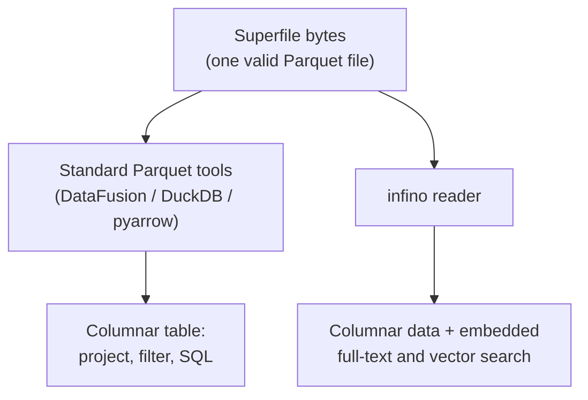

# Superfile

A superfile is infino's segment format. Each superfile is a single,
self-contained file that is also a valid
[Apache Parquet](https://parquet.apache.org/docs/) file. Standard
Parquet tools read it as an ordinary columnar table; infino reads the
same file as a search segment, with full-text and vector indexes
available alongside the columnar data.

This document describes the format and its guarantees. The table layer
that composes many superfiles into one queryable table is described in
[supertable](./supertable.md).

## Design

- **Single file.** One superfile is one segment: the columnar data and
  its search indexes live in the same file, with no sidecars to keep
  in sync.
- **Parquet-compatible.** A superfile is a standards-compliant Parquet
  file. Any Parquet reader can open it and read the columnar data with
  no infino-specific support.
- **Immutable.** A superfile is written once and never modified in
  place. Changes are expressed by writing new superfiles.
- **Search-native.** Full-text and vector search indexes are part of
  the segment, not a separate system layered on top of it.

## Layout

A superfile is a Parquet file with index regions placed between the
Parquet row groups and the Parquet footer:

```text
[ Parquet row groups          ]   columnar data
[ Full-text index  (optional) ]
[ Vector index     (optional) ]
[ Parquet footer              ]
```

The footer is a standard Parquet footer. infino records the location
and configuration of its index regions in the footer's key-value
metadata, under a reserved namespace. Parquet readers ignore metadata
keys they do not recognize, so the presence of the indexes does not
affect Parquet compatibility.

## Parquet compatibility

Compatibility is a property of the bytes, not a conversion step:

- The file begins with Parquet data and ends with a standard Parquet
  footer and trailer.
- The schema, row groups, and column data are written by a standard
  Parquet writer.
- The index regions are opaque to Parquet readers and lie outside the
  row-group ranges described by the footer.
- Index metadata is namespaced in the footer's key-value metadata and
  is ignored by readers that do not use it.

As a result, tools such as
[DataFusion](https://datafusion.apache.org/),
[DuckDB](https://duckdb.org/), and
[pyarrow](https://arrow.apache.org/docs/python/) can read a superfile
as a normal table — projecting columns, filtering rows, and running
SQL over the columnar data — without any infino-specific support.
infino uses the same footer to locate the embedded indexes when
full-text or vector search is requested.



## Full-text index

The full-text index is an inverted index supporting
[BM25](https://en.wikipedia.org/wiki/Okapi_BM25) ranking over one or
more text columns. It is built in the following stages:

- **Tokenization.** Each indexed text value is tokenized into terms,
  and the per-document term frequencies and document lengths that BM25
  needs are accumulated as documents are added.
- **Term dictionary.** Indexed terms are stored in a
  [finite-state transducer](https://blog.burntsushi.net/transducers/),
  a compact, ordered dictionary that maps each term to its postings and
  supports prefix lookups.
- **Posting lists.** For each term, the documents that contain it are
  stored as a delta- and bit-packed posting list together with the
  per-document term frequencies, kept in document order.
- **Block metadata.** Posting lists are divided into fixed-size blocks,
  and each block carries the maximum BM25 contribution any document in
  it can produce. This upper bound lets search skip whole blocks that
  cannot enter the top results.

A query runs in two stages:

1. Resolve each query term through the term dictionary to its posting
   list.
2. Walk the posting lists in document order, using the per-block upper
   bounds to skip blocks that cannot improve the current top results,
   and rank the surviving documents with BM25.

Document identifiers in the index are local to the superfile.

## Vector index

The vector index supports approximate nearest-neighbor search over one
or more vector columns, under L2, cosine, or inner-product metrics. It
is built in the following stages:

- **Rotation.** A deterministic random rotation is applied to every
  vector, spreading information evenly across dimensions so that the
  binary codes below are uniformly informative.
- **Clustering (IVF).** Rotated vectors are partitioned into clusters
  with k-means, forming an inverted-file index. A query scans only the
  clusters nearest the query rather than the entire column.
- **Binary codes.** Each vector is encoded as a compact binary
  (one bit per dimension) code derived from its rotated form, using
  [RaBitQ](https://arxiv.org/abs/2405.12497). These codes drive a fast,
  approximate first-pass scan.
- **Rerank payload.** Each vector also carries a rerank representation
  used to order candidates precisely. It is configurable per column:
  full-precision floats, a compact quantized code with a residual
  correction (the default), or none (binary codes only).
- **Cluster-contiguous storage.** A cluster's centroid metadata, binary
  codes, document identifiers, and rerank payloads are laid out
  together, so evaluating a cluster is a contiguous read.

A query runs in two stages:

1. Score the query against the cluster centroids and select the nearest
   clusters to probe.
2. Scan the binary codes of the probed clusters to build a candidate
   shortlist, then rerank the shortlist with the per-column rerank
   representation and return the top results.

Document identifiers in the index are local to the superfile.

## Integrity

Index regions are checksummed. The default read path verifies the
checksums when a superfile is opened, so corruption is detected before
any query runs against it.

## Reading from a byte source

A superfile can be opened against a *byte source* instead of a fully
materialized buffer. Because the footer records the exact location of
every region, a reader can address the Parquet row groups and each
index region by range rather than needing the whole file in hand.

A byte source abstracts where those bytes come from — an in-memory
buffer, a memory-mapped local file, or an object store served by
ranged reads. It offers a zero-copy fast path for ranges already
resident in memory and an asynchronous fetch for ranges that are not,
can present a sub-region of a larger object as its own source, and can
overlay a handful of pre-fetched ranges so that the several small
reads issued while opening a segment are satisfied from one fetch
rather than many round-trips.

Opening this way reads only the metadata ranges the reader needs, not
the whole segment: the Parquet footer, then the full-text and vector
section headers and directories. The reader does not retain the full
segment bytes — a source-opened reader cannot hand back the original
Parquet file for a pass-through tool, and a caller that needs that uses
the eager open path instead.

Queries then fetch only the regions they touch. A full-text query
resolves its terms through the dictionary and fetches each term's
posting list on demand; the postings region is never read in full. A
vector query fetches the centroids and then only the blocks of the
clusters it probes. So a segment on object storage answers a query by
pulling a bounded set of ranges rather than downloading the file
first.

## Scope

- A superfile is a single segment. Querying across many segments is the
  table layer's responsibility (see [supertable](./supertable.md)).
- A superfile is immutable and is queryable only once it is fully
  written.
- Full-text search is bag-of-words BM25; phrase and positional queries
  are not part of the format.
